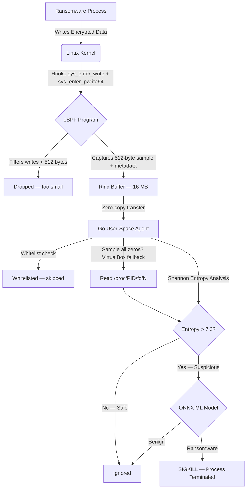

<div align="center">

# eRDS
## eBPF Ransomware Defense System

[](https://golang.org/)
[](https://ebpf.io/)
[](https://kernel.org/)
[](https://onnx.ai/)
[](LICENSE)

**Real-Time Ransomware Detection & Prevention  
via Kernel-Level Telemetry + ML Inference**

GLA University, Mathura  
Cyber Security Mini-Project — 2026

</div>

---

## Overview

Traditional antivirus solutions are reactive — they wait for known signatures.

**eRDS is behavioral and proactive.**

Running inside the Linux kernel using eBPF, it intercepts every `write(2)` and `pwrite64(2)` syscall in real time, captures a 512-byte sample of the data being written, and performs Shannon entropy analysis to detect encryption activity characteristic of ransomware — before widespread damage can occur.

A second-stage ONNX Random Forest classifier further validates detections using both entropy score and write size, reducing false positives from legitimate tools like compressors and media encoders.

When a process is confirmed malicious, the agent sends `SIGKILL` immediately — stopping encryption in its tracks.

---

## Team

| Role | Name | Responsibility |
|------|------|----------------|
| **Team Leader** | **Anav** | System Architecture, Core Logic, Project Coordination |
| **Member** | **Jay** | eBPF Kernel Hooks, C Implementation |
| **Member** | **Sandesh** | User-Space Agent, Golang Integration |
| **Member** | **Shantanu** | Testing, Simulation, Documentation |

---

## Architecture

eRDS follows a split kernel/user-space architecture to balance performance, safety, and detection flexibility.



---

## Kernel Layer — The Watcher

The eBPF program is attached to two tracepoints and fires on every matching syscall system-wide:

- `tracepoint/syscalls/sys_enter_write`
- `tracepoint/syscalls/sys_enter_pwrite64`

Both syscalls are hooked because modern OpenSSL and libc versions may use either depending on the kernel version and file descriptor type.

For every qualifying write event the probe:

- **Filters small writes** (< 512 bytes) — too small for bulk encryption, dropped in-kernel to reduce ring buffer pressure
- **Captures process identity** — PID, UID, process name (`comm`), file descriptor number
- **Zero-initialises** the 512-byte sample buffer before reading
- **Samples 512 bytes** from the write buffer via `bpf_probe_read_user`
- **Pushes the event** into a 16 MB ring buffer for zero-copy transfer to user space

Built using **eBPF CO-RE** (Compile Once – Run Everywhere) for portability across Linux 5.8+ kernels without runtime kernel header dependency.

### Event Layout (552 bytes)

```
u32  pid         offset   0   (4 bytes)
u32  uid         offset   4   (4 bytes)
char comm[16]    offset   8   (16 bytes)
u64  write_len   offset  24   (8 bytes)
u64  fd          offset  32   (8 bytes)
u8   sample[512] offset  40   (512 bytes)
```

---

## User-Space Layer — The Decision Engine

The Go agent asynchronously consumes events from the ring buffer and runs a three-stage detection pipeline:

### Stage 0 — Process Whitelist

Whitelisted processes are skipped immediately before any analysis. This prevents false positives on legitimate high-entropy tools.

### Stage 1 — Shannon Entropy Analysis

| Entropy Range | Interpretation | Action |
|---------------|----------------|--------|
| 0.0 – 4.0 | Plain text, source code, configuration | Safe — ignored |
| 4.0 – 6.5 | Structured binary (ELF, databases) | Safe — ignored |
| 6.5 – 7.0 | Compressed / media data | Safe — ignored |
| **7.0 – 8.0** | **High-density encrypted data** | **Suspicious → Stage 2** |

### VirtualBox / Hypervisor Fallback

In some hypervisor environments (VirtualBox, Hyper-V), `bpf_probe_read_user` may silently return zeroed bytes due to memory isolation restrictions. The agent automatically detects an all-zero sample and falls back to reading the file directly via `/proc/PID/fd/N`, which always works when running as root.

### Stage 2 — ONNX Random Forest Classifier

If entropy exceeds 7.0, the event is passed to a Random Forest model trained on two features:

| Feature | Benign Range | Malicious Range |
|---------|-------------|-----------------|
| Shannon entropy | ≈ 4.5 mean | ≈ 7.8 mean |
| Write size (bytes) | 10 – 5,000 | 4,000 – 8,000 |

If the model confirms ransomware, `SIGKILL` is sent to the offending PID.

If the model file is absent, the agent falls back to entropy-only detection automatically — no crash.

---

## Safety Guards

| Guard | Description |
|-------|-------------|
| **PID 0 protection** | Agent refuses to kill the kernel idle process |
| **PID 1 protection** | Agent refuses to kill `init`/`systemd` |
| **Self-kill protection** | Agent refuses to kill its own PID |
| **Duplicate-kill dedup** | Mutex-protected set prevents sending SIGKILL multiple times to the same PID |
| **Pre-kill liveness check** | `signal(0)` probe before SIGKILL — already-dead processes treated as success |
| **Process whitelist** | 16 known high-entropy tools exempt from kill decision |

---

## Process Whitelist

The following 16 processes are whitelisted and will never be killed, even if their writes produce high entropy:

`zip`, `gzip`, `bzip2`, `xz`, `zstd`, `7z`, `7za`, `scp`, `sftp`, `ssh`, `gpg`, `gpg2`, `ffmpeg`, `age`, `chrome`, `firefox`

> **Note:** `openssl` is intentionally **not** whitelisted so the standard demo test command fires a real detection event out of the box.

---

## Project Structure

```
erds_final_clean/
├── Makefile
├── go.mod
├── go.sum
├── bpf/
│   ├── monitor.bpf.c       ← eBPF kernel probe (C) — hooks write + pwrite64
│   └── vmlinux.h           ← generated from running kernel via bpftool
├── cmd/
│   └── agent/
│       ├── main.go         ← Go user-space agent (main entry point)
│       ├── gen.go          ← bpf2go code generation directive
│       ├── monitor_bpfel.go← auto-generated Go bindings for eBPF objects
│       └── monitor_bpfel.o ← pre-compiled eBPF bytecode
├── dist/
│   └── ransomware-agent    ← compiled binary (after make build)
├── model/
│   ├── train.py            ← Random Forest training script (Python)
│   └── ransomware.onnx     ← exported ONNX model (pre-trained, ready to use)
└── pkg/
    ├── detection/
    │   ├── detector.go     ← Shannon entropy + ONNX inference pipeline
    │   └── detector_test.go← Unit tests for entropy and detection logic
    ├── ebpf/
    │   └── loader.go       ← eBPF constants and documentation
    └── process/
        ├── killer.go       ← SIGKILL with all safety guards
        └── killer_test.go  ← Unit tests for all safety guards
```

---

## Requirements

| Dependency | Version | Purpose |
|------------|---------|---------|
| Linux kernel | 5.8+ | `BPF_MAP_TYPE_RINGBUF` support |
| Go | 1.22+ | Build the user-space agent |
| clang / llvm | Any recent | Compile eBPF C code |
| libbpf-dev | Any recent | eBPF library headers |
| bpftool | Any recent | Generate `vmlinux.h` |
| Python 3 + pip | 3.8+ | Retrain the ONNX model (optional) |

---

## Installation & Build

### 1. Install dependencies

```bash
sudo apt update
sudo apt install -y clang llvm libbpf-dev linux-headers-amd64 bpftool golang-go make python3 python3-pip
```

### 2. Clone and enter the project

```bash
git clone https://github.com/skgpt254/Cyber_Mini-Project.git
cd Cyber_Mini-Project-main
```

### 3. Sync Go dependencies

```bash
go mod tidy
```

### 4. Generate `vmlinux.h` from your running kernel

```bash
sudo make vmlinux
```

> Only needed once per machine, or after a kernel upgrade.

### 5. Compile eBPF bytecode and generate Go bindings

```bash
make generate
```

### 6. Build the Go agent

```bash
make build
```

### 7. Run (requires root)

```bash
sudo ./dist/ransomware-agent
```

Expected startup output:

```
  ╔══════════════════════════════════════════════╗
  ║   eRDS — eBPF Ransomware Defense System      ║
  ║   GLA University, Mathura  ·  2026           ║
  ╚══════════════════════════════════════════════╝

🤖  ML model       : Loaded (model/ransomware.onnx)
🛡️   Monitoring     : sys_enter_write + sys_enter_pwrite64
📊  Entropy cutoff : 7.0 bits/byte
✅  Whitelisted    : 16 processes
🔒  Safety guards  : PID0/PID1/self-kill + dedup active
   Press Ctrl-C to stop.
```

### 8. (Optional) Retrain the ONNX model

```bash
pip install --break-system-packages scikit-learn skl2onnx pandas numpy
make train
```

> A pre-trained `ransomware.onnx` is already included. Skip this step unless you want to retrain.

---

## Testing

> ⚠️ Run these tests only in a controlled environment. Never on production systems.

### Safe file test

```bash
echo "This is a safe text file for the GLA project." > notes.txt
```

**Expected:** No alert. Low entropy (≈ 3.5) — ignored silently.

---

### Simulated ransomware test

```bash
openssl rand -out encrypted_test.bin 4096
```

**Expected agent output:**

```
🚨 [ALERT]    High entropy write detected!
   PID       : 12345
   Process   : openssl
   UID       : 0
   FD        : 3
   Entropy   : CRITICAL  (7.5603 bits/byte)
   Reason    : entropy > threshold AND ML model: ransomware
   Write len : 4096 bytes
   Cmdline   : openssl rand -out encrypted_test.bin 4096
   ✅ [KILLED]  PID 12345 terminated successfully.
```

**In the terminal running openssl:**
```
zsh: killed     openssl rand -out encrypted_test.bin 4096
```

### Large random write test

```bash
dd if=/dev/urandom of=encrypted_test.bin bs=4096 count=1000
```

### Enable debug logging (development only)

To see every captured write event, uncomment this line in `cmd/agent/main.go`:

```go
// fmt.Printf("[DBG] pid=%-6d comm=%-15s fd=%-3d len=%-6d src=%-4s entropy=%.4f malicious=%v\n",
```

Then `make build` and re-run.

---

## Makefile Reference

| Command | Description |
|---------|-------------|
| `sudo make vmlinux` | Generate `bpf/vmlinux.h` from running kernel |
| `make generate` | Compile eBPF C → bytecode + generate Go bindings |
| `make train` | Retrain and export the ONNX model |
| `make build` | Compile the Go agent binary |
| `sudo make run` | Build + run with sudo |
| `make tidy` | Sync `go.mod` / `go.sum` |
| `make clean` | Remove build artifacts |

---

## Troubleshooting

| Error | Fix |
|-------|-----|
| `Failed to remove memlock limit` | Run with `sudo` |
| `Failed to load eBPF objects` | Run `make generate` first; check kernel ≥ 5.8 |
| `Failed to attach tracepoint` | Run with `sudo` |
| `vmlinux.h: No such file` | Run `sudo make vmlinux` first |
| `missing go.sum entry` | Run `go mod tidy` |
| `clang: command not found` | `sudo apt install clang llvm` |
| `externally-managed-environment` (pip) | Add `--break-system-packages` flag to pip |
| No alerts firing in VirtualBox | Agent auto-handles via `/proc/PID/fd` fallback — ensure running as root |
| `linux-headers-$(uname -r)` not found | Use `linux-headers-amd64` instead on Kali/Debian |

---

## Roadmap

- [x] eBPF CO-RE kernel probe (`sys_enter_write` + `sys_enter_pwrite64`)
- [x] 512-byte sample capture per event
- [x] Shannon entropy analysis with labeled ranges
- [x] ONNX Random Forest second-stage classifier — wired in and active
- [x] `/proc/PID/fd` fallback for VirtualBox / hypervisor environments
- [x] Process whitelist — 16 entries, false positive prevention
- [x] Duplicate-kill deduplication (mutex-protected)
- [x] PID 0 / PID 1 / self-kill safety guards
- [x] Pre-kill liveness probe via `signal(0)`
- [x] Full cmdline logging via `/proc/PID/cmdline`
- [x] Graceful shutdown via signal handler
- [x] Unit tests for entropy, detection pipeline, and all safety guards
- [ ] Honeyfile deployment (decoy files that trigger on access)
- [ ] Command & Control (C2) outbound traffic blocking
- [ ] Web-based real-time monitoring dashboard
- [ ] Full `onnxruntime_go` binding for native ONNX inference

---

## License

Distributed under the MIT License. See `LICENSE` for details.

---

<div align="center">

**Secure the Kernel. Secure the System.**

</div>
